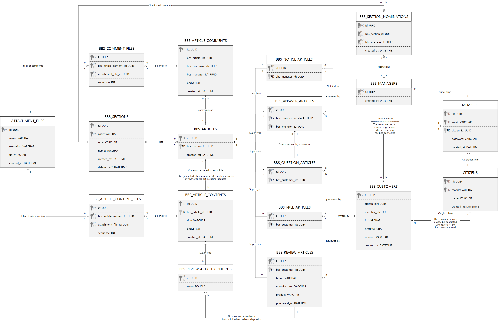

# Payments Server
## 1. Outline
[](https://github.com/samchon/payments-server/blob/master/LICENSE)
[](https://www.npmjs.com/package/payments-server-api)
[](https://www.npmjs.com/package/payments-server-api)
[](https://github.com/samchon/payments-server/actions?query=workflow%3Abuild)

`payments-server` 는 통합 결제 서버를 구현한 프로젝트이다. 

여기서 말하는 통합 결제란, [아임포트](https://github.com/samchon/fake-iamport-server)나 [토스 페이먼츠](https://github.com/samchon/fake-toss-payments-server) 등, 여러 PG 사들을 일괄 관리할 수 있다는 뜻이다. 더하여 `payments-server` 는 MSA (Micro Service Architecture) 를 고려하여 설계된 프로젝트로써, 귀하의 서비스 중 결제 부문만을 따로이 분리하여 관리할 수 있다.

또한 `payments-server` 가 연동하게 되는 결제 PG 사들은 본디 프론트 어플리케이션과 연동한 수기 테스트가 필요하다. 이 때문에 이들 결제 PG 사들과 연동해야 하는 결제 서버들은, 테스트 자동화 프로그램을 작성할 수 없기에, 필연적으로 테스트 커버리지가 낮아 매우 불안정해진다. 하지만 `payments-server` 는 결제 PG 사들의 API 를 흉내낸 가짜 PG 서버들을 구현, 이들을 통하여 테스트 자동화 프로그램을 구성함으로써 안정성을 담보한다.

  - [samchon/fake-iamport-server](https://github.com/samchon/fake-iamport-server)
  - [samchon/fake-toss-payments-server](https://github.com/samchon/fake-toss-payments-server)

마지막으로 `payments-server` 는 [payments-server-api](https://www.npmjs.com/package/payments-server-api) 라 하여, 통합 결제 서버와 연동할 수 있는 SDK 라이브러리를 제공한다. 귀하는 이 [payments-server-api](https://www.npmjs.com/package/payments-server-api) 를 통하여, 통합 결제 서버와 매우 손쉽게 연동할 수 있고, 이를 통하여 결제 부문에 관련된 MSA (Micro Service Architecture) 를 매우 안전하게 구성할 수 있다.

  - 자료구조 매뉴얼: [src/api/structures/IPaymentHistory.ts](https://github.surf/samchon/payments-server/blob/HEAD/src/api/structures/IPaymentHistory.ts)
  - API 함수 매뉴얼: [src/api/functional/histories/index.ts](https://github.surf/samchon/payments-server/blob/HEAD/src/api/functional/histories/index.ts)
  - 예제 코드
    - 아임포트
      - 결제 기록하기: [test_fake_iamport_payment_history.ts](https://github.surf/samchon/payments-server/blob/HEAD/src/test/features/fake/examples/test_fake_iamport_payment_history.ts)
      - 간편 결제 등록하기: [test_fake_iamport_reservation.ts](https://github.surf/samchon/payments-server/blob/HEAD/src/test/features/fake/examples/test_fake_iamport_reservation.ts)
      - 웹훅 이벤트 리스닝: [test_fake_iamport_webhook.ts](https://github.surf/samchon/payments-server/blob/HEAD/src/test/features/fake/examples/)
    - 토스 페이먼츠
      - 결제 기록하기: [test_fake_toss_payment_history.ts](https://github.surf/samchon/payments-server/blob/HEAD/src/test/features/fake/examples/test_fake_toss_payment_history.ts)
      - 간편 결제 등록하기: [test_fake_toss_payment_reservation.ts](https://github.surf/samchon/payments-server/blob/HEAD/src/test/features/fake/examples/test_fake_toss_payment_reservation.ts)
      - 웹훅 이벤트 리스닝: [test_fake_toss_payment_webhook.ts](https://github.surf/samchon/payments-server/blob/HEAD/src/test/features/fake/examples/test_fake_toss_payment_webhook.ts)

```typescript
import { v4 } from "uuid";

import imp from "iamport-server-api";
import payments from "payments-server-api";
import { IIamportPayment } from "iamport-server-api/lib/structures/IIamportPayment";
import { IIamportResponse } from "iamport-server-api/lib/structures/IIamportResponse";
import { IPaymentHistory } from "payments-server-api/lib/structures/IPaymentHistory";

import { IamportAsset } from "../../../../services/iamport/IamportAsset";

export async function test_fake_iamport_payment_history
    (connection: payments.IConnection): Promise<void>
{
    // 주문 정보
    const yourOrderId: string = v4(); // 귀하의 백엔드 서버가 발행한 주문 ID
    const yourOrderPrice: number = 12_000; // 주문 금액

    // 아임포트 결제 시뮬레이션
    const payment: IIamportResponse<IIamportPayment> = 
        await imp.functional.subscribe.payments.onetime
        (
            await IamportAsset.connection("test-iamport-store-id"),
            {
                card_number: "1234-1234-1234-1234",
                expiry: "2028-12",
                birth: "880311",

                merchant_uid: yourOrderId,
                amount: yourOrderPrice,
                name: "Fake 주문"
            }
        );
    
    // 결제 이력 등록하기
    const history: IPaymentHistory = await payments.functional.histories.store
    (
        connection,
        {
            vendor: {
                code: "iamport",
                store_id: "test-iamport-store-id",
                uid: payment.response.imp_uid,
            },
            source: {
                schema: "some-schema",
                table: "some-table",
                id: yourOrderId
            },
            webhook_url: "https://github.com/samchon",
            price: yourOrderPrice,
            password: "some-password",
        }
    );

    // 결제 내역 조회하기
    const read: IPaymentHistory = await payments.functional.histories.at
    (
        connection,
        history.id,
        {
            password: "some-password"
        }
    );

    // if condition 을 통한 하위 타입 특정
    if (read.vendor_code === "iamport")
        read.data.imp_uid;
}
```


## 2. Installation
### 2.1. NodeJS
본 서버 프로그램은 TypeScript 로 만들어졌으며, NodeJS 에서 구동된다. 

고로 제일 먼저 할 일은, NodeJS 를 설치하는 것이다. 아래 링크를 열어, NodeJS 프로그램을 다운로드 받은 후 즉각 설치하기 바란다. 참고로 NodeJS 버전은 어지간히 낮은 옛 시대의 버전만 아니면 되니, 구태여 Latest 버전을 설치할 필요는 없으며, Stable 버전만으로도 충분하다.

  - https://nodejs.org/en/

### 2.2. MariaDB
본 서버는 MariaDB 를 사용하고 있다. 따라서 로컬에서 백엔드 서버를 개발하고 구동하려거든, MySQL DB 가 반드시 설치되어있어야 한다. 아래 링크에서 설치 마법사를 다운로드하여, MariaDB 10.5.8 버전을 설치할 것.

  - https://downloads.mariadb.org/mariadb/10.5.8/

사용자 아이디와 암호는 모두 `root` 로 설정해준다. 그리고 MariaDB 터미널로 접속하여 아래 SQL 구문을 입력함으로써, `payments` 스키마를 새로 생성해준다. 참고로 MariaDB 는 기본 캐릭터셋이 `utf8` 이 아닌 `latin1` 이다. 따라서 아래 SQL 구문을 실행할 때, 뒷쪽의 `CHARATER SET` 구문을 빠트리는 일이 없도록 한다.

> ```bash
> sudo mysqladmin -u root password 'root'
> ```

그리고 로컬 DB 의 `SQL_MODE` 를 `ONLY_FULL_GROUP_BY` 으로 설정할 것이다. `ONLY_FULL_GROUP_BY` 이란, GROUP BY 를 사용한 SQL Select 구문에서 집계 함수를 사용하지 아니한 필드가 있거든 Syntax Error 가 나도록 하는 설정이다. 로컬 개발 중에 잘못된 SQL 집계문 사용을 방지하기 위하여, 엄격한 문법 검사 모드로 MariaDB 로컬 DB 를 운용하기 위함이다.

```sql
CREATE SCHEMA payments
    DEFAULT CHARACTER SET utf8mb4 
    COLLATE utf8mb4_unicode_ci;
SET GLOBAL sql_mode = 'ANSI,TRADITIONAL';
```

### 2.3. Server
NodeJS 의 설치가 끝났다면, 바로 `payments-server` 구동을 시작할 수 있다. 

제일 먼저 `git clone` 을 통하여, 결제 서버 프로젝트를 로컬 저장소에 복사하도록 한다. 그리고 해당 폴더로 이동하여 `npm install` 명령어를 실행함으로써, 통합 결제 서버를 구동하는 데 필요한 라이브러리들을 다운로드 한다. 그리고 `npm run build` 명령어를 입력하여, 결제 서버의 소스 코드를 컴파일한다.

마지막으로 `npm run start` 명령어를 실행해주면, 결제 서버가 구동된다. 

```bash
# CLONE REPOSITORY
git clone https://github.com/samchon/payments-server
cd payments-server

# INSTALLATION & COMPILATION
npm install
npm run build

# START SERVER & STOP SERVER
npm run start
npm run stop
```

[](https://www.npmjs.com/package/payments-server)
[](https://www.npmjs.com/package/payments-server)

더하여 `payments-server` 는 npm 모듈로 설치하여 구동할 수 있다.

귀하의 백엔드 서버 테스트 자동화 프로그램이 `payments-server` 의 설정과 개설 및 폐쇄를 모두 통제하고자 할 때는, github 저장소를 clone 하는 것보다, 이처럼 npm 모듈을 설치하여 import 하는 것이 훨씬 더 알맞다.

따라서 귀하의 백엔드 서버가 TypeScript 내지 JavaScript 를 사용한다면, 테스트 자동화 프로그램을 구성함에 있어 github 저장소를 clone 하여 `payments-server` 를 별도 구동하기보다, 귀하의 백엔드 서버 테스트 프로그램에서 `payments-server` 의 개설과 폐쇄를 직접 통제하기를 권장한다.

```typescript
// npm install --save-dev payments-server
import payments from "payments-server";

async function main(): Promise<void>
{
    // CONFIGURATION
    payments.PaymentConfiguration.mode = "LOCAL";
    payments.PaymentConfiguration.testing = true;

    // BACKEND OPENING
    const backend: payments.PaymentBackend = new payments.PaymentBackend();
    await backend.open();
    await backend.close();
}
```

### 2.4. SDK
[](https://www.npmjs.com/package/payments-server-api)
[](https://www.npmjs.com/package/payments-server-api)

본 프로젝트 `payments-server` 는 SDK 라이브러리를 제공한다.

귀하는 이 `payments-server-api` 를 통하여, 통합 결제 서버와 매우 손쉽게 연동할 수 있고, 이를 통하여 결제 부문에 관련된 MSA (Micro Service Architecture) 를 매우 안전하게 구성할 수 있다.

  - 자료구조 매뉴얼: [src/api/structures/IPaymentHistory.ts](https://github.surf/samchon/payments-server/blob/HEAD/src/api/structures/IPaymentHistory.ts)
  - API 함수 매뉴얼: [src/api/functional/histories/index.ts](https://github.surf/samchon/payments-server/blob/HEAD/src/api/functional/histories/index.ts)
  - 예제 코드
    - 아임포트
      - 결제 기록하기: [test_fake_iamport_payment_history.ts](https://github.surf/samchon/payments-server/blob/HEAD/src/test/features/fake/examples/test_fake_iamport_payment_history.ts)
      - 간편 결제 등록하기: [test_fake_iamport_reservation.ts](https://github.surf/samchon/payments-server/blob/HEAD/src/test/features/fake/examples/test_fake_iamport_reservation.ts)
      - 웹훅 이벤트 리스닝: [test_fake_iamport_webhook.ts](https://github.surf/samchon/payments-server/blob/HEAD/src/test/features/fake/examples/)
    - 토스 페이먼츠
      - 결제 기록하기: [test_fake_toss_payment_history.ts](https://github.surf/samchon/payments-server/blob/HEAD/src/test/features/fake/examples/test_fake_toss_payment_history.ts)
      - 간편 결제 등록하기: [test_fake_toss_payment_reservation.ts](https://github.surf/samchon/payments-server/blob/HEAD/src/test/features/fake/examples/test_fake_toss_payment_reservation.ts)
      - 웹훅 이벤트 리스닝: [test_fake_toss_payment_webhook.ts](https://github.surf/samchon/payments-server/blob/HEAD/src/test/features/fake/examples/test_fake_toss_payment_webhook.ts)

```bash
npm install --save payments-server-api
```


## 3. Development
### 3.1. Definition


If you want to add a new feature or update ordinary thing in the API level, you should write the code down to the matched *API controller*, who is stored in the [src/controllers](src/controllers) directory as the [Main Program](#34-main-program). 

However, [@samchon](https://github.com/samchon) does not recommend to writing code down into the [Main Program](#34-main-program) first, without any consideration. Instead, [@samchon](https://github.com/samchon) recommends to declare the definition first and implement the [Main Program](#34-main-program) later.

Therefore, if you want to add a new feature in the API level, define the matched data entity in the [src/models](src/models) and [src/api/structures](src/api/structures) directories. After the data entity definition, declare function header in the matched API controller class in the [src/controllers](src/controllers). Note that, it's only the declaration, header only, not meaning to implement the function body.

After those declarations, build the [SDK](#32-sdk) through the `npm run build:api` command and implement the [Test Automation Program](#33-test-automation-program) using the [SDK](#32-sdk) with use case scenarios. Development of the [Main Program](#34-main-program) should be started after those preparations are all being ready. Of course, the [Main Program](#34-main-program) can be verified with the pre-developed [Test Automation Program](#33-test-automation-program) in everytime.

  - Declare data entity
  - Declare API function header
  - Build [SDK](32-sdk)
  - Implement the [Test Automation Program](#33-test-automation-program)
  - Develop the [Main Program](#34-main-program)
  - Validate the [Main Program](#34-main-program) through the [Test Automation Program](#33-test-automation-program)
  - Deploy to the Dev and Real servers.

### 3.2. SDK
[`@samchon/payments-backend`](https://github.com/samchon/payments) provides SDK (Software Development Kit) for convenience.

For the client developers who are connecting to this backend server, [`@samchon/payments-backend`](https://github.com/samchon/payments) provides not API documents like the Swagger, but provides the API interaction library, one of the typical SDK (Software Development Kit) for the convenience.

With the SDK, client developers never need to re-define the duplicated API interfaces. Just utilize the provided interfaces and asynchronous functions defined in the SDK. It would be much convenient than any other Rest API solutions.

To build the SDK, just type the `npm run build:api` command. The SDK would be generated by [`nestia`](https://github.com/samchon/nestia), by analyzing source code of the [controller](src/controllers) classes in the compilation level, automatically. After the SDK building, you can publish the SDK through the `npm publish` command.

```bash
# BUILD SDK AND PUBLISH IT
npm run build:api
npm run package:api
```

When the SDK has been published, client programmers can interact with this backend server very easily. Just let them to install the SDK and call the SDK functions with the `await` symbol like below.

```typescript
import api from "@samchon/bbs-api";

import { IBbsCitizen } from "@samchon/bbs-api/lib/structures/bbs/actors/IBbsCitizen";
import { IBbsQuestionArticle } from "@samchon/bbs-api/lib/structures/bbs/articles/IBbsQuestionArticle";
import { IBbsSection } from "@samchon/bbs-api/lib/api/structures/bbs/systematic/IBbsSection";

async function main(): Promise<void>
{
    //----
    // PREPARATIONS
    //----
    // CONNECTION INFO
    const connection: api.IConnection = {
        host: "http://127.0.0.1:37001",
        password: {
            key: "pJXhbHlYfzkC1CBK8R67faaBgJWB9Myu",
            iv: "IXJBt4MflFxvxKkn"
        }
    };

    // ISSUE A CUSTOMER ACCOUNT
    const customer: IBbsCustomer = await api.functional.bbs.customers.authenticate.issue
    (
        connection,
        {
            href: window.location.href,
            referrer: window.document.referrer
        }
    );

    // ACTIVATE THE CUSTOMER
    customer.citizen = await api.functional.bbs.customers.authenticate.activate
    (
        connection,
        {
            name: "Jeongho Nam",
            mobile: "821036270016"
        }
    );

    //----
    // WRITE A QUESTION ARTICLE
    //----
    // FIND TARGET SECTION
    const sectionList: IBbsSection[] = await api.functional.bbs.customers.systematic.sections.index
    (
        connection
    );
    const section: IBbsSection = sectionList.find(section => section.type === "qna")!;

    // PREPARE INPUT DATA
    const input: IBbsQuestionArticle.IStore = {
        title: "Some Question Title",
        body: "Some Question Body Content...",
        files: []
    };

    // DO WRITE
    const question: IBbsQuestionArticle = await api.functional.bbs.customers.articles.qna.store
    (
        connection, 
        section.code,
        input
    );
    console.log(question);
}
```

### 3.3. Test Automation Program
> TDD (Test Driven Development)

After the [Definition](#31-definition) and [SDK](#32-sdk) generation, you've to design the use-case scenario and implement a test automation program who represents the use-case scenario and guarantees the [Main Program](#34-main-program).

To add a new test function in the Test Automation Program, create a new TS file under the [src/test/features](src/test/features) directory following the below category and implement the test scenario function with representative function name and `export` symbol. I think many all of the ordinary files wrote in the [src/test/features](src/test/features) directory would be good sample for you. Therefore, I will not describe how the make the test function detaily.

  - [src/test/features/api](src/test/features/api)
    - About the [SDK](#32-sdk) that would be provided to the frontend developers,
    - Validate the matched API implemented in the [Main Program](#34-main-program)
    - Use all of the API functions, through lots of scenarios
    - Most of the test functions are belonged to this category
  - [src/test/features/models](src/test/features/models)
    - About the ORM Model classes
    - Validate tables, methods, and even materialized views
    - through lots of scenarios
  - [src/test/features/external](src/test/features/external)
    - Open virtual external systems
    - Validate interactions with this backend server

Anyway, you've to remind that, the Test Automation Program resets the DB schema whenever being run. Therefore, you've to be careful if import data has been stored in the local (or dev) DB server. To avoid the resetting the DB, configure the `skipReset` option like below.

Also, the Test Automation Program runs all of the test functions placed into the [src/test/features](src/test/features) directory. However, those full testing may consume too much time. Therefore, if you want to reduce the testing time by specializing some test functions, use the `include` option like below.

  - supported options
    - `mode`: mode of the target server
      - *local*
      - *dev*
      - ~~*real*~~
    - `include`: test only restricted functions who is containing the special keyword.
    - `exclude`: exclude some functions who is containing the special keyword.
    - `skipReset`: do not reset the DB
    - `count`: repeating count of the test automation program.

```bash
# test in the dev server
npm run test -- --mode=dev

# test without db reset
npm run test -- --skipReset

# test only restricted functions whose name contain the "something" keyword
# do not reset db
npm run test -- --include=something --skipReset
```

### 3.4. Main Program
After [Definition](#31-definition), [SDK](#32-sdk) building and [Test Automation Program](#33-test-automation-program) are all prepared, finally you can develop the Main Program. Also, when you complete the Main Program implementation, it would better to validate the implementation through the pre-built [SDK](#32-sdk) and [Test Automation Program](#33-test-automation-program).

However, do not commit a mistake that writing source codes only in the [controller](src/controllers) classes. The API Controller must have a role that only intermediation. The main source code should be write down separately following the directory categorizing. For example, source code about DB I/O should be written into the [src/providers](src/providers) directory.


## 4. Deploy
### 4.1. Non-distruptive Update System
If you committed a new version and pushed it into the repository, you can update the backend server without any distruption. By the `npm run update` command, you can let backend server to act those non-distruptive update processes.

  - Pull new commit
  - Build the new soure code
  - Restart the backend server without distruption

To accomplish the non-distruptive update system, the server instance must run the updator program before mounting the backend server program up. If the target backend system is composed with multiple server instances like ELB (Elastic Load Balancer) and target instance is not a type of the master instance, you should write the `npm run start:updator:slave` command. 

Otherwise, use the `npm run start:updator:master` command.

```bash
#----
# RUN UPDATOR PROGRAM
#----
# THE INSTANCE IS MASTER
npm run start:updator:master

# THE INSTANCE IS SLAVE
npm run start:updator:slave

#----
# MOUNT THE BACKEND SERVER UP
#----
npm run start real
```

### 4.2. Local Server
Sometimes, you may desire to mount the backend server on your local system, not for running the [Test Automation Program](#33-test-automation-program), but for other reason like the *Front-end Application Development*. 

In that case, you can mount the local backend server up and let it to keep the opening status, until the `npm run stop` command be executed, by typing the `npm run start local` command.

```bash
npm run start local
npm run stop
```

Also, if someone else committed a new version into the master branch, you can update your local backend server without distruption. It means that, non-distruptive update system even works in the local environment. To activate the non-distruptive update system, run the updator program before mounting the backend server up on your local machine.

```bash
# START THE LOCAL BACKEND SERVER WITH UPDATOR PROGRAM
npm run start updator:master
npm run start local

# UPDATE THE LOCAL SERVER WITHOUT DISTRUPTION
npm run update local
```

### 4.3. Dev Server
To update the dev server is very easy. Just commit a new code into the `dev` branch, and type the `npm run update dev` command on your local machine. By the command, the dev server will replace its code to the latest and the [Non-distruptive Update System](#41-non-distruptive-update-system) would be executed.

```bash
npm run update dev
```

Also, the dev server is designed to test and validate the newly commited source code before releasing to the [Real Server](#44-real-server). Therefore, even dev server may required to reset its DB like the [Local Server](#42-local-server) who oftens run the [Test Automation Program](#33-test-automation-program).

```bash
# MOVE TO THE PROJECT DIRECTORY
ssh ${dev_address}
cd ${project_directory}

# DO RESET
npm run reset:dev

# REFERENCE - COMMAND SET COMPOSING THE RESET:DEV
git pull
npm install
npm run build
npx pm2 delete all
npm run test -- --mode=dev
npm run start:updator:master
npm run start dev
```

### 4.4. Real Server
To update the dev server is very easy. Just commit a new code into the `dev` branch, and type the `npm run update real` command on your local machine. By the command, the dev server will replace its code to the latest and the [Non-distruptive Update System](#41-non-distruptive-update-system) would be executed.

```bash
npm run update real
```


## 5. Appendix
### 5.1. NPM Dev Dependencies
Running the `npm publish` command in this project means that, publishing the [SDK](#32-sdk). 

Therefore, if you want to install any npm module required for the backend server, you've to install the module using the `--save-dev` option. Otherwise, there's an npm module that is required for the [SDK](#32-sdk), use the `--save-dev` tag.

```bash
# REQUIRED FOR BACKEND SERVER
npm install --save-dev encrypted-nestjs
npm install --save-dev nestia
npm install --save-dev safe-typeorm

# REQUIRED FOR SDK
npm install --save node-fetch
```

### 5.2. NPM Run Commands
List of the run commands defined in the [package.json](package.json) are like below:

  - `build`: Compile the source code
    - `build:api`: Build SDK libray for the client developers
    - `build:models`: Build ORM library
  - `dev`: Incremental compilation using the `--watch` option
  - `reset:dev`: Restart the dev backend server with DB reset
  - `start`: Start the backend server
    - `npm run start local`
    - `npm run start dev`
    - `npm run start real`
  - `start:updator:master`: Start non-distruptive update system (master)
  - `start:updator:slave`: Start non-distruptive update system (slave)
  - `start:reload`: Restart the backend server
  - `stop`: Stop the backend server
  - `stop:updator:master`: Stop non-distruptive update system (master)
  - `stop:updator:salve`: Stop non-distruptive update system (slave)
  - `test`: Start the [Test Automation Program](#33-test-automation-program)
  - `test:update`: Test the non-distruptive update system
  - `update`: Start the non-distruptive update
    - npm run update dev
    - npm run update real

### 5.3. Github Action
[](https://github.com/samchon/payments/actions?query=workflow%3Abuild)

This backend project utilizes the Github Action to run the cloud CI (Continuous Integration) test whenever a commit or PR event occurs. The CI test starts from installing the backend server program to a clean Ubuntu system that nothing has been installed yet.

You know what? All of CI processes, like installing required programs into the clean Ubuntu and compiling and running the Test Automation Program, are defined in the [`.github/workflows/build.yml`](.github/workflows/build.yml) script file. Also <font color="green">passing</font> or <font color="red">failure</font> expressed from the above [badge](https://github.com/samchon/payments/actions?query=workflow%3Abuild) represents outcome of the CI test.

### 5.4. Related Repositories
> Write the related repositories down.


## 5. Appendix
### 5.1. Nestia
Automatic SDK generator for the NestJS.

  - https://github.com/samchon/nestia

Nesita 는 NestJS 로 만든 백엔드 서버 프로그램을 컴파일러 수준에서 분석, 클라이언트가 사용할 수 있는 SDK 라이브러리를 만들어주는 프로그램이다. `fake-iamport-server` 가 아임포트의 API 를 흉내내어 만든 가짜 서버인데, 뜬금 클라이언트가 진짜 아임포트와의 연동에 사용할 수 있는 SDK 라이브러리가 함께 제공되는 이유도 바로 이 덕분이다.

때문에 만일 귀하가 아임포트와 연동하는 백엔드 서버를 개발 중이라면, `fake-iamport-server` 뿐 아니라 [Nestia](https://github.com/samchon/nestia) 도 함께 사용해보는 것이 어떠한가? 귀하의 백엔드 서버 또한 `fake-iamport-server` 처럼 클라이언트 개발자가 사용할 수 있는 SDK 라이브러리를 자동으로 빌드하여 배포할 수 있으니, 백엔드 개발자는 API 문서를 따로 만들고 클라이언트 개발자는 중복 DTO 타입과 API 연동 함수를 개발하는 등의 번거로운 일을 일절 하지 않아도 된다.

### 5.2. Fake Payment Servers


### 5.3. Archidraw
https://www.archisketch.com/

I have special thanks to the Archidraw, where I'm working for.

The Archidraw is a great IT company developing 3D interior editor and lots of solutions based on the 3D assets. Also, the Archidraw is the first company who had adopted `fake-iamport-server` on their commercial backend project, even `fake-iamport-server` was in the alpha level.